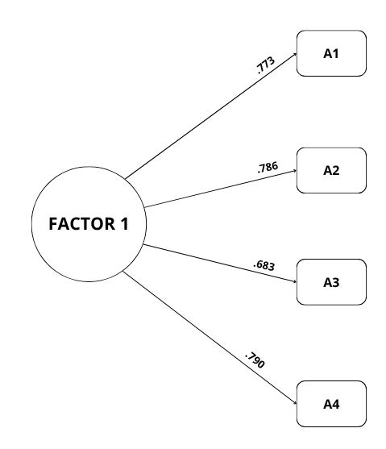

```{r header, echo=FALSE, results='asis'}
source("../template/header.R")
```

## Introducción

Las actitudes constituyen uno de los conceptos centrales de la psicología social para comprender el modo en que las personas evalúan objetos, fenómenos, grupos o prácticas socialmente relevantes. En términos generales, pueden entenderse como disposiciones evaluativas que expresan grados de favorabilidad o desfavorabilidad hacia un determinado objeto actitudinal, vinculadas con creencias, valoraciones y predisposiciones de acción [@allport1935; @ajzen1991]. En el caso de la inteligencia artificial (IA), las actitudes permiten indagar cómo esta tecnología es valorada por distintos grupos sociales, qué expectativas despierta, qué temores moviliza y en qué medida se la percibe como útil, confiable o deseable.

El estudio de las actitudes resulta especialmente pertinente para abordar tecnologías emergentes, dado que las evaluaciones sociales suelen formarse en contextos de información incompleta, experiencias desiguales de uso y alta circulación de discursos públicos. La IA constituye un objeto actitudinal particularmente dinámico, en tanto muchas personas toman posición frente a ella a partir de usos concretos, pero también a partir de narrativas sociales sobre automatización, innovación, riesgo, reemplazo laboral, sesgos, transformación educativa o cambio en el mundo del trabajo [@becerra_mezzadra_movia2025]. De este modo, las actitudes hacia la IA pueden expresar experiencias directas con herramientas específicas, evaluaciones generales sobre sus consecuencias sociales y disposiciones prácticas frente a su incorporación en la vida cotidiana.

La incorporación acelerada de la IA a distintos ámbitos de la vida social ha ampliado la relevancia empírica de este constructo. En pocos años, estas tecnologías pasaron a intervenir en prácticas vinculadas con el trabajo, la educación, la salud, la producción científica, la comunicación, la creatividad y la búsqueda cotidiana de información [@becerra_mezzadra_ruiz_gambino2025]. A diferencia de otros objetos tecnológicos más delimitados, la IA aparece asociada simultáneamente con promesas de eficiencia, innovación y ampliación de capacidades, pero también con preocupaciones vinculadas al sesgo algorítmico, la privacidad, la pérdida de control, la sustitución laboral, la dependencia tecnológica y la opacidad de los sistemas automatizados [@chen_xie2025; @grassini2023; @schepman_rodway2022]. Esta amplitud de sentidos vuelve necesario disponer de herramientas que permitan evaluar las orientaciones generales de la población frente a la IA.

En diversos trabajos se ha identificado que las actitudes hacia la IA presentan un carácter complejo y, en muchos casos, ambivalente. @schepman_rodway2020 y @schepman_rodway2022, a partir del desarrollo y validación de la General Attitudes towards Artificial Intelligence Scale (GAAIS), proponen que el estudio de las actitudes hacia la IA se deben realizar en dos dimensiones: positiva y negativa. Esta distinción permite reconocer que una misma persona puede valorar ciertos beneficios de esta tecnología y, al mismo tiempo, expresar preocupación por sus posibles riesgos. En una línea complementaria, algunos estudios recientes han recuperado el modelo tripartito de las actitudes, diferenciando componentes cognitivos, afectivos y conductuales en la evaluación de herramientas de IA generativa [@veith_bauer2026]. Desde este enfoque, las actitudes hacia la IA pueden involucrar percepciones sobre su utilidad, emociones de confianza o inquietud, y predisposiciones concretas al uso.

La ambivalencia frente a la IA resulta comprensible si se considera que estas tecnologías suelen ser presentadas públicamente a partir de registros discursivos contrastantes. Por un lado, se las asocia con la optimización de tareas, el aumento de productividad, la personalización de servicios, la ampliación del acceso a información y la asistencia en procesos educativos o profesionales. Por otro lado, se las vincula con riesgos éticos, vigilancia, discriminación algorítmica, automatización de decisiones sensibles, precarización laboral o pérdida de autonomía. Esta coexistencia de expectativas y preocupaciones hace que la medición de actitudes hacia la IA requiera instrumentos capaces de captar orientaciones generales sin perder de vista que el objeto evaluado se encuentra atravesado por tensiones sociales, económicas y culturales.

Además de su ambivalencia, las actitudes hacia la IA no se distribuyen de manera homogénea entre los distintos grupos sociales. Diversas investigaciones han señalado diferencias asociadas al género, la edad, el área de formación, el campo profesional y el grado de familiaridad previa con estas tecnologías [@almaraz_lopez2023; @mogelvang_grassini2025]. En este sentido, los estudios disponibles indican que quienes poseen mayor experiencia de uso o pertenecen a áreas técnico-científicas tienden a expresar valoraciones más favorables, mientras que otros grupos pueden mostrar mayores reservas frente a sus impactos sociales, educativos o laborales. Esta relación entre experiencia, posición social y actitud resulta relevante para la medición, ya que la adopción de sistemas de IA no avanza de manera uniforme entre sectores sociales, niveles educativos y campos profesionales.

En este marco, @grassini2023 desarrolló la AI Attitude Scale (AIAS-4), una escala breve destinada a medir la actitud general hacia la inteligencia artificial. La escala se orienta a captar una evaluación global de la IA mediante cuatro ítems que abordan: la percepción de utilidad personal, el impacto positivo en la vida cotidiana y en el trabajo o estudio, las intenciones futuras de uso y la valoración general de sus efectos en la humanidad. Su diseño responde a la necesidad de contar con un instrumento parsimonioso, de rápida administración y con propiedades psicométricas adecuadas para estudios cuantitativos. La versión original partió de un conjunto inicial de ítems que, tras los análisis factoriales y de consistencia interna, se redujo a una estructura de cuatro ítems con mejor ajuste y coherencia interna [@grassini2023]. Posteriormente, @mogelvang_grassini2025 aportaron nueva evidencia de validez y fiabilidad de la AIAS-4 en una muestra amplia de estudiantes universitarios noruegos.

Esta línea de validaciones recientes se ha ampliado a otros contextos lingüísticos, culturales y poblacionales. En América Latina, @moralesgarcia_sairitupa2024 adaptaron y evaluaron la AIAS-4 en una muestra de enfermeros peruanos, aportando evidencia de estructura unidimensional, consistencia interna e invarianza de medida. En Turquía, @satici_okur2025 confirmaron la estructura unifactorial de la escala, su fiabilidad y su validez de constructo, incorporando además análisis de invarianza por género y teoría de respuesta al ítem. En Europa, @zanetti_usseglio2026 validaron una versión italiana en trabajadores, mientras que @luquereca_penacoba2026 aportaron evidencia para una versión española en estudiantes universitarios, incluyendo fiabilidad test-retest, invarianza por género y asociaciones con el uso académico de herramientas de IA. En conjunto, estos antecedentes sugieren que la AIAS-4 ha mostrado un desempeño psicométrico adecuado en poblaciones diversas, aunque todavía resulta necesario contar con evidencia situada en el contexto argentino.

La brevedad de la AIAS-4 constituye una ventaja para investigaciones que integran la medición de actitudes hacia la IA dentro de encuestas más amplias. En estudios que combinan variables sociodemográficas, frecuencia de uso, creencias, experiencias previas u otros indicadores psicosociales, una escala breve permite reducir la carga de respuesta sin resignar una medición sistemática del constructo. Al centrarse en una actitud general hacia la IA, también facilita comparaciones entre grupos y el análisis de asociaciones con dimensiones vinculadas con su aceptación, apropiación o uso cotidiano. Este rasgo resulta particularmente útil en investigaciones aplicadas, estudios comparativos y relevamientos con muestras amplias, donde los instrumentos extensos pueden dificultar la recolección de datos y aumentar el abandono de los cuestionarios. La AIAS-4 ofrece una alternativa adecuada para medir una orientación evaluativa general sin sobrecargar los formularios.

En este contexto, el presente estudio tuvo como objetivo general adaptar lingüística y contextualmente la AI Attitude Scale (AIAS-4) de @grassini2023 al español de Argentina y evaluar sus propiedades psicométricas en una muestra de adultos argentinos usuarios de inteligencia artificial. Como objetivos específicos, se propuso: (a) adaptar la escala mediante un procedimiento sistemático de traducción y retrotraducción con juicio de expertos y prueba piloto; (b) evaluar su fiabilidad mediante los coeficientes alfa de Cronbach y omega de McDonald; (c) analizar su estructura unidimensional mediante análisis factorial confirmatorio (en adelante, AFC); y (d) examinar la invarianza de medida de la escala en función del género mediante análisis multigrupo.

## Método

### Diseño

Se realizó un estudio instrumental de diseño transversal, con un enfoque cuantitativo no experimental orientado a la adaptación y validación de la AI Attitude Scale (AIAS-4) de @grassini2023 al contexto argentino.

### Participantes

La muestra total del estudio original fue de 525 adultos, reclutados mediante un muestreo no probabilístico por bola de nieve a través de redes sociales, listas de correo institucionales y grupos profesionales. Para los análisis de adaptación y validación, se seleccionó exclusivamente a los participantes residentes en Argentina, con el objetivo de asegurar la pertinencia cultural y lingüística del instrumento adaptado. De esta manera, la muestra final quedó constituida por 426 participantes argentinos mayores de 18 años -el resto provenía de España, Uruguay y otros países hispanohablantes-, quienes declararon haber utilizado herramientas de inteligencia artificial con frecuencias diversas en los últimos 12 meses. Cabe señalar que no se estableció como criterio de exclusión la no utilización de IA para participar de la encuesta.

La edad promedio fue de 41.2 años (DE = 13.6), con un rango entre 18 y 74 años. En términos de género, el 62.7% se identificó como mujer (n = 267), el 36.4% como varón (n = 155) y menos del 1% como no binario o prefirió no responder (n = 4). En cuanto al nivel educativo, el 84.5% contaba con estudios universitarios o de posgrado, con predominio de nivel de grado (57.5%). La frecuencia de uso de IA se distribuyó de la siguiente manera: uso esporádico (22.1%), ocasional (29.8%), frecuente (45.3%), y solo 12 participantes (2.8%) declararon no utilizar IA. Dado el perfil educativo elevado y la alta familiaridad con la IA, los resultados deben interpretarse como preliminares y no generalizables a la población general argentina.

### Instrumentos

Se administró una encuesta autoadministrada en línea que incluyó la Escala de actitud hacia la IA (AIAS-4). Se utilizó la versión original en inglés de la *AI Attitude Scale* desarrollada por @grassini2023, compuesta por cuatro ítems que evalúan la actitud general hacia la inteligencia artificial como constructo unidimensional. Los ítems indagan: (1) valoración de su efecto global en la humanidad, (2) percepción de utilidad personal, (3) impacto en la vida y el trabajo, y (4) intenciones futuras de uso. Las respuestas se registran en una escala tipo Likert de cinco puntos (1 = totalmente en desacuerdo; 5 = totalmente de acuerdo). La escala original reportó una fiabilidad aceptable (α = .75 - .80). Para este estudio, se sometió a un proceso de adaptación lingüística y cultural al español de Argentina.

Adicionalmente, se incluyeron preguntas sobre variables sociodemográficas y de uso: edad, género, nivel educativo, área de trabajo, país de residencia y frecuencia de uso de herramientas de IA (nunca, esporádicamente, ocasionalmente, frecuentemente).

### Procedimientos de recolección de datos

La encuesta se administró de forma autoadministrada a través de un formulario web diseñado específicamente para el estudio[^1]. La recolección de datos se realizó durante los meses de octubre y noviembre del 2025. El reclutamiento se llevó a cabo mediante técnicas de muestreo no probabilístico por bola de nieve a través de redes sociales, listas de correo institucionales y grupos profesionales vinculados a educación, tecnología y ciencias sociales. El formulario incluía un consentimiento informado inicial en el que se explicaban los objetivos del estudio, el carácter voluntario de la participación, la confidencialidad de las respuestas y la posibilidad de abandonar la encuesta en cualquier momento. El tiempo medio de respuesta fue de aproximadamente 10-12 minutos.

### Procedimiento de adaptación de la AIAS-4

Para la adaptación de la AIAS-4 al español de Argentina se siguieron las pautas internacionales para la adaptación transcultural de instrumentos [@hambleton_merenda2004; @internationaltestcommission2017]:

1.  *Traducción directa*. Dos traductores bilingües (inglés-español) nativos argentinos realizaron de forma independiente una traducción de la escala original al español.

2.  *Síntesis de traducciones*. Un tercer investigador, también bilingüe y con experiencia en psicometría, comparó ambas traducciones y resolvió las discrepancias mediante consenso, produciendo una versión sintetizada.

3.  *Retrotraducción*. Dos traductores bilingües diferentes, sin conocimiento de la versión original, retrotradujeron la versión sintetizada al inglés.

4.  *Comité de expertos*. Un panel compuesto por tres investigadores con experiencia en medición de actitudes tecnológicas y en el estudio de la IA comparó la versión original, la retrotraducción y la versión sintetizada, evaluando la equivalencia semántica, idiomática, experiencial y conceptual.

5.  *Prueba piloto*. La versión adaptada se administró a una submuestra de 30 adultos argentinos usuarios de IA, quienes completaron la escala y participaron en una breve entrevista cognitiva para identificar posibles problemas de comprensión.

La versión final adaptada mantuvo la estructura de cuatro ítems (Tabla 1) y el formato de respuesta tipo Likert de cinco puntos.

**Tabla 1**

*Ítems de la escala AIAS-4 traducidos al español argentino*

| **Ítem** | **Contenido**                                                               |
|----------|-----------------------------------------------------------------------------|
| **A1**   | Considero que la inteligencia artificial es positiva para la humanidad      |
| **A2**   | Considero que la inteligencia artificial mejorará mi vida                   |
| **A3**   | Considero que la inteligencia artificial mejorará mi trabajo o mis estudios |
| **A4**   | Considero que utilizaré tecnologías de inteligencia artificial en el futuro |

### Análisis de datos

Todos los análisis se realizaron utilizando el software jamovi (versión 2.7) sobre la submuestra de participantes argentinos (N = 426). Previamente a los análisis, se verificaron los supuestos de normalidad mediante la prueba de Shapiro-Wilk, observándose desviaciones significativas en todos los ítems (p < .001), por lo que se utilizaron métodos robustos cuando correspondió.

#### Consistencia interna

Se calculó la fiabilidad de la escala mediante el coeficiente alfa de Cronbach (α) y el omega de McDonald (ω), considerando valores ≥ .70 como aceptables. Siguiendo las recomendaciones de @clark_watson2019 y @hair_black2019, se esperaron correlaciones inter-ítem moderadas (entre .30 y .80) como evidencia de que los ítems miden el mismo constructo sin resultar redundantes. Asimismo, se examinaron las correlaciones ítem-total corregidas (esperándose ≥ .30) y el α si se elimina el elemento para evaluar la contribución de cada ítem a la consistencia interna de la escala.

#### Estructura factorial y análisis factorial confirmatorio (AFC)

Para evaluar la estructura unidimensional de la escala, se realizó un AFC utilizando el módulo SEMLj de jamovi. Dado que los ítems fueron medidos en una escala tipo Likert de cinco puntos y presentaron desviaciones significativas de la normalidad (Shapiro-Wilk p < .001), se especificó el estimador WLSMV (Weighted Least Squares Mean and Variance adjusted) [@li2016; @muthen_muthen2017], recomendado para datos ordinales en modelos de ecuaciones estructurales. El software implementó internamente el estimador DWLS (Diagonally Weighted Least Squares), reportando los índices de ajuste robustos y escalados, que son los que se interpretan.

Se especificó un modelo de un solo factor latente con los cuatro ítems como indicadores. Se evaluó el ajuste del modelo mediante los siguientes índices: CFI (Comparative Fit Index), TLI (Tucker-Lewis Index), SRMR (Standardized Root Mean Square Residual) y RMSEA (Root Mean Square Error of Approximation). Se consideraron valores de CFI y TLI ≥ .90 como aceptables (≥ .95 como excelentes), SRMR ≤ .08 como aceptable. Dado que el modelo presenta solo 2 grados de libertad, el RMSEA no se utilizó como criterio principal de ajuste, siguiendo las recomendaciones de @kenny_kaniskan2015 para modelos con pocos grados de libertad. Asimismo, se calcularon las cargas factoriales estandarizadas de cada ítem, considerando valores ≥ .50 como aceptables [@hair_black2019; @jordanmuinos2021].

#### Invarianza de medida por género

Para determinar si la escala mide el mismo constructo en varones y mujeres[^2], se realizó un AFC multigrupo mediante el módulo SEMLj de jamovi. Se compararon secuencialmente tres modelos anidados:

- Modelo configural: misma estructura factorial en ambos grupos (sin restricciones de igualdad)

- Modelo métrico: restricción de cargas factoriales iguales entre grupos

- Modelo escalar: restricción de cargas factoriales e interceptos iguales entre grupos

Se consideró evidencia de invarianza cuando los cambios en CFI (ΔCFI) entre modelos consecutivos fueron ≤ .010 [@chen2007; @cheung_rensvold2002].

### Consideraciones éticas

El estudio se realizó siguiendo los principios éticos establecidos en la Declaración de Helsinki y la legislación argentina sobre protección de datos personales [@congresoargentina2000]. Todos los participantes otorgaron su consentimiento informado de forma explícita al iniciar la encuesta. No se recogieron datos de identificación personal que permitieran rastrear las respuestas individuales.

## Resultados

### Adaptación de la escala AIAS-4 al contexto de Argentina

Para evaluar las propiedades psicométricas de la versión adaptada de la AI Attitude Scale (AIAS-4) [@grassini2023] en población argentina, se analizaron los datos de los 426 participantes residentes en el país.

#### Análisis descriptivos de los ítems

La Tabla 2 presenta los estadísticos descriptivos de los cuatro ítems de la escala. Las medias oscilaron entre 3.36 (A1) y 4.25 (A3), indicando actitudes mayoritariamente favorables hacia la IA. Los valores de asimetría (-1.45 a -.38) y curtosis (.01 a 3.52) se encontraron dentro de rangos aceptables [@kline2016]. La prueba de Shapiro-Wilk resultó significativa para todos los ítems (p < .001), lo que era esperable dado el tamaño muestral (N = 426) y justifica el uso de métodos de estimación robustos en los análisis posteriores.

**Tabla 2**

*Estadísticos descriptivos de los ítems de la AIAS-4 (N = 426)*

| **Ítem** | **M** | **DE** | **Asimetría** | **Curtosis** | **Shapiro-Wilk (p)** |
|----------|-------|--------|---------------|--------------|----------------------|
| **A1**   | 3.36  | .945   | -.38          | .01          | \< .001              |
| **A2**   | 3.89  | .867   | -.92          | 1.12         | \< .001              |
| **A3**   | 4.25  | .790   | -1.45         | 3.52         | \< .001              |
| **A4**   | 3.57  | .852   | -.50          | .31          | \< .001              |

*Nota*. M = media; DE = desviación típica.

#### Consistencia interna

La fiabilidad de la escala se estimó mediante el coeficiente alfa de Cronbach y el omega de McDonald. Los resultados mostraron valores adecuados: α = .784 y ω = .787 (Tabla 3), superando ambos el umbral mínimo recomendado de .70. Las correlaciones ítem-total corregidas oscilaron entre .507 y .631, superando todas el criterio de .30. El análisis de α al eliminar un elemento indicó que la eliminación de cualquier ítem no mejoraba sustancialmente la consistencia interna (valores entre .711 y .771) (Tabla 4), lo que sugiere que todos los ítems contribuyen positivamente a la fiabilidad de la escala. Adicionalmente, las correlaciones inter-ítem oscilaron entre .376 y .555 (Tabla 5), indicando asociaciones moderadas entre los reactivos sin evidenciar redundancia excesiva. Estos resultados sugieren una adecuada homogeneidad interna de los ítems que conforman la escala.

**Tabla 3**

*Fiabilidad de la escala AIAS-4*

|            | **Alfa de Cronbach** | **ω de McDonald** | **N elementos** |
|------------|----------------------|-------------------|-----------------|
| **AIAS-4** | .784                 | .787              | 4               |

**Tabla 4**

*Fiabilidad de cada elemento de la escala AIAS-4*

|        |                            | Fiabilidad si se descarta el reactivo |                   |
|--------|----------------------------|---------------------------------------|-------------------|
|        | **Correlación ítem-total** | **Alfa de Cronbach**                  | **ω de McDonald** |
| **A1** | .606                       | .726                                  | .734              |
| **A2** | .631                       | .711                                  | .723              |
| **A3** | .507                       | .771                                  | .775              |
| **A4** | .626                       | .714                                  | .724              |

*Nota*. r₍ᵢ₋ₜ₎ = correlación ítem-total corregida (Rho de Spearman).

**Tabla 5**

*Matriz de correlaciones inter-ítem de la AIAS-4 (N = 426)*

| **Ítem** | **A1** | **A2** | **A3** | **A4** |
|----------|--------|--------|--------|--------|
| **A1**   | 1.000  | -     |        |        |
| **A2**   | .485   | 1.000  | -     |        |
| **A3**   | .409   | .500   | 1.000  | -     |
| **A4**   | .555   | .513   | .376   | 1.000  |

*Nota*. Coeficiente Rho de Spearman. Todas las correlaciones son significativas con p < .001.

#### Análisis factorial confirmatorio (AFC)

Para evaluar la estructura unidimensional de la versión adaptada de la AIAS-4, se realizó un AFC utilizando el módulo SEMLj de jamovi [@gallucci_jentschke2021]. Dado que los ítems fueron medidos en una escala tipo Likert de cinco puntos y presentaron desviaciones significativas de la normalidad (Shapiro-Wilk p < .001), se especificó el estimador WLSMV (Weighted Least Squares Mean and Variance adjusted) [@muthen_muthen2017], recomendado para datos ordinales en modelos de ecuaciones estructurales.

Se especificó un modelo de un solo factor latente con los cuatro ítems como indicadores (A1, A2, A3, A4). Este modelo postula que toda la covarianza entre los ítems es explicada por un único constructo subyacente: la actitud general hacia la inteligencia artificial, consistente con la validación original de la escala [@grassini2023].

El modelo mostró un ajuste adecuado a excelente: χ² escalado = 25.92 (gl = 2, p < .001); CFI escalado = .983; TLI escalado = .949; SRMR robusto = .027. Si bien el estadístico χ² resultó significativo –lo cual es esperable en muestras de este tamaño (N = 426)–, los índices de ajuste complementarios superaron ampliamente los criterios de aceptación (CFI ≥ .90, TLI ≥ .90, SRMR ≤ .08) (Tabla 6). En cuanto al RMSEA robusto (.203), debe interpretarse con cautela, dado que los modelos con muy pocos grados de libertad (gl = 2) tienden a sobreestimarlo, por lo que no se considera un criterio principal de ajuste en este contexto [@kenny_kaniskan2015].

**Tabla 6**

*Índices de ajuste del análisis factorial confirmatorio (AFC) de la escala AIAS-4*

|            | **χ² (gl)**               | **CFI** | **TLI** | **SRMR** |
|------------|---------------------------|---------|---------|----------|
| **AIAS-4** | 25.92 (gl = 2, p < .001) | .983    | .949    | .027     |

*Nota*. No se reporta el RMSEA debido a su sobreestimación en modelos con pocos grados de libertad (gl = 2).

Las cargas factoriales estandarizadas fueron todas significativas (p < .001) y oscilaron entre .683 y .790, superando ampliamente el umbral mínimo de .50 recomendado [@hair_black2019] (Tabla 7). El ítem con mayor carga fue A4 ("Considero que utilizaré tecnologías de inteligencia artificial en el futuro"; β = .790), seguido de A2 ("Considero que la inteligencia artificial mejorará mi vida"; β = .786) y A1 ("Considero que la inteligencia artificial es positiva para la humanidad"; β = .773). El ítem A3 ("Considero que la inteligencia artificial mejorará mi trabajo o mis estudios") presentó la carga más baja, aunque todavía dentro del rango excelente (β = .683).

**Tabla 7**

*Cargas factoriales estandarizadas del modelo unifactorial de la AIAS-4 (N = 426)*

| **Ítem** | **Contenido**                            | **β** | **z** | **p**   |
|----------|------------------------------------------|-------|-------|---------|
| **A1**   | La IA es positiva para la humanidad      | .773  | -    | -      |
| **A2**   | La IA mejorará mi vida                   | .786  | 21.1  | \< .001 |
| **A3**   | La IA mejorará mi trabajo o mis estudios | .683  | 17.5  | \< .001 |
| **A4**   | Utilizaré tecnologías de IA en el futuro | .790  | 24.3  | \< .001 |

*Nota*. La carga del ítem A1 se fijó en 1.000 para la identificación del modelo. β = carga factorial estandarizada

En conjunto, los resultados del AFC respaldan la estructura unidimensional de la versión adaptada de la AIAS-4 al contexto argentino (Figura 1). El modelo propuesto se ajusta adecuadamente a los datos, y todos los ítems presentan cargas factoriales significativas y de magnitud excelente (β entre .683 y .790). Por tanto, la escala resulta apropiada para evaluar la actitud general hacia la inteligencia artificial en la población argentina.

**Figura 1. Modelo estructural unidimensional de la AIAS-4 adaptada al contexto argentino**



*Nota*. Los valores sobre las flechas son las cargas factoriales estandarizadas (β). Todas las cargas fueron significativas con p < .001.

#### Invarianza de medida por género

Para determinar si la escala mide el mismo constructo en varones y mujeres, se realizó un AFC multigrupo mediante el módulo SEMLj de jamovi [@gallucci_jentschke2021]. Se utilizó el estimador robusto WLSMV (implementado internamente como DWLS), recomendado para datos ordinales. Se compararon secuencialmente tres modelos anidados: configural (misma estructura factorial), métrico (cargas factoriales iguales) y escalar (cargas e interceptos iguales).

Los resultados mostraron que el modelo escalar -el más restrictivo- presentó un excelente ajuste: CFI escalado = .992, TLI escalado = .977, SRMR = .028, RMSEA escalado = .181 (Tabla 8). Si bien el RMSEA es elevado, debe interpretarse con cautela dado el reducido número de grados de libertad del modelo (gl = 2) y las recomendaciones de la literatura para modelos pequeños [@kenny_kaniskan2015].

**Tabla 8**

*Índices de ajuste del modelo de invarianza escalar (género)*

| **Modelo** | **χ² (gl)**              | **CFI** | **TLI** | **SRMR** | **RMSEA** |
|------------|--------------------------|---------|---------|----------|-----------|
| Escalar    | 31.5 (gl = 4, p < .001) | .992    | .977    | .028     | .181      |

*Nota*. Los índices corresponden a la columna “Scaled” del output de jamovi.

El alto valor del CFI (.992) y del TLI (.977) indica que las restricciones de igualdad de cargas e interceptos entre grupos no deterioran significativamente el ajuste del modelo (ΔCFI ≤ .010). Asimismo, la prueba de restricciones arrojó un χ² total no significativo (p > .05), lo que confirma que las diferencias entre grupos no son estadísticamente significativas.

En conjunto, estos resultados respaldan la invarianza escalar de la AIAS-4 adaptada entre varones y mujeres. Esto implica que la escala mide el mismo constructo en la misma escala métrica en ambos grupos, permitiendo comparaciones válidas de medias y correlaciones entre géneros [@chen2007; @cheung_rensvold2002].

## Discusión y conclusiones

El presente estudio tuvo como objetivo adaptar lingüística y contextualmente la AI Attitude Scale (AIAS-4) de @grassini2023 al español de Argentina y evaluar sus propiedades psicométricas en una muestra de adultos argentinos usuarios de inteligencia artificial. Los resultados obtenidos indican que la versión adaptada de la escala presenta propiedades psicométricas adecuadas para su empleo en el contexto local, con niveles de fiabilidad y validez de constructo comparables a los reportados en la validación original y en estudios posteriores en otros contextos culturales.

En primer lugar, la consistencia interna de la escala resultó aceptable, con valores de α = .784 y ω = .787. Estos coeficientes se ubican dentro del rango reportado por @grassini2023 en la validación original (α entre .75 y .80) y son consistentes con los hallazgos de @mogelvang_grassini2025 en una muestra de estudiantes universitarios noruegos (α = .78), así como con los reportados en las adaptaciones peruana [@moralesgarcia_sairitupa2024], turca [@satici_okur2025] y española [@luquereca_penacoba2026]. Las correlaciones ítem-total corregidas (entre .507 y .631) superaron el umbral mínimo de .30 recomendado por la literatura [@field2018], y el análisis de α si se elimina un elemento indicó que todos los ítems contribuyen positivamente a la fiabilidad de la escala.

En segundo lugar, el AFC respaldó la estructura unidimensional de la escala propuesta por el autor original. A diferencia de los trabajos que emplearon estimadores basados en máxima verosimilitud (ML) asumiendo normalidad, el presente estudio utilizó el estimador WLSMV (Weighted Least Squares Mean and Variance adjusted), recomendado para datos ordinales [@li2016; @muthen_muthen2017]. Los índices de ajuste obtenidos (CFI escalado = .983; TLI escalado = .949; SRMR robusto = .027) superaron ampliamente los criterios de aceptación (CFI y TLI ≥ .90; SRMR ≤ .08). El valor del RMSEA robusto (.203), si bien elevado, debe interpretarse con cautela, dado que los modelos con muy pocos grados de libertad (gl = 2) tienden a sobreestimar este índice. Tal como señalan @kenny_kaniskan2015, en modelos con grados de libertad reducidos el RMSEA no constituye un criterio principal de ajuste. Las cargas factoriales estandarizadas (β entre .683 y .790) resultaron todas significativas y superaron el umbral mínimo de .50 recomendado [@hair_black2019], con valores incluso superiores a los reportados en la validación original [@grassini2023]. Estos hallazgos confirman que la versión adaptada de la AIAS-4 conserva la estructura factorial de la escala original.

En tercer lugar, el análisis de invarianza de medida por género constituye un aporte novedoso no reportado en la validación original de @grassini2023 ni en la mayoría de las adaptaciones previas. Los resultados indicaron que la escala es invariante a nivel escalar entre varones y mujeres (ΔCFI ≤ .010; CFI escalado = .992), lo que permite comparaciones válidas de medias entre ambos grupos. Este hallazgo resulta especialmente relevante para futuros estudios que analicen diferencias de género en actitudes hacia la IA, un aspecto documentado en la literatura [@mogelvang_grassini2025] pero que requiere de instrumentos que garanticen la equivalencia métrica entre grupos.

Cabe señalar que, si bien se observó una pérdida de 5 casos en el análisis de invarianza debido al manejo listwise de valores perdidos, el tamaño muestral final (N = 422) sigue siendo adecuado para los análisis realizados. Investigaciones previas han demostrado que los índices de ajuste no se ven significativamente afectados por la pérdida moderada de casos cuando la muestra es de tamaño considerable [@chen2007].

En lo que respecta a las limitaciones del estudio, sería conveniente que futuros trabajos cuenten con muestras más representativas de la población general argentina, dado que la presente muestra presentó un nivel educativo elevado (84.5% con estudios universitarios o de posgrado) y una alta familiaridad con el uso de IA, lo que puede limitar la generalización de los resultados a poblaciones con menor nivel educativo o menor exposición a estas tecnologías. Asimismo, el muestreo no probabilístico por bola de nieve, si bien es una estrategia habitual en estudios de validación, puede haber introducido sesgos de selección. Futuras investigaciones podrían complementar estos hallazgos con muestras de mayor diversidad sociodemográfica y con diseños que incluyan la administración de la escala en momentos temporales diferentes para evaluar su fiabilidad test-retest.

Otra limitación a considerar es la ausencia de evaluación de la validez discriminante de la escala mediante su correlación con constructos no relacionados teóricamente con la actitud hacia la IA (por ejemplo, escalas de personalidad o de deseabilidad social). Si bien el objetivo del estudio se centró en la adaptación y validación de constructo de la AIAS-4, futuros trabajos podrían ampliar la evidencia de validez mediante el análisis de relaciones con otras variables externas.

A pesar de estas limitaciones, el presente estudio logró adaptar y validar la AI Attitude Scale (AIAS-4) de @grassini2023 para su empleo en población argentina. Los resultados indican que la AIAS-4 adaptada al español de Argentina constituye un instrumento válido y confiable para la evaluación de la actitud general hacia la inteligencia artificial. La escala resulta apropiada para su uso en investigaciones sobre aceptación tecnológica, estudios comparativos entre grupos, y relevamientos que requieran de una medida breve y de rápida administración.

[^1]: Disponible en https://studio--ethical-compass-ycikd.us-central1.hosted.app/

[^2]: Para los análisis de invarianza por género, se excluyeron los participantes que se identificaron como no binarios o prefirieron no responder (n = 4), debido al reducido tamaño del grupo, se analizó exclusivamente la comparación entre varones (n = 155) y mujeres (n = 267).


## Referencias

<div id="refs"></div>

```{r footer, echo=FALSE, results="asis"}
source("../template/footer.R")
```
